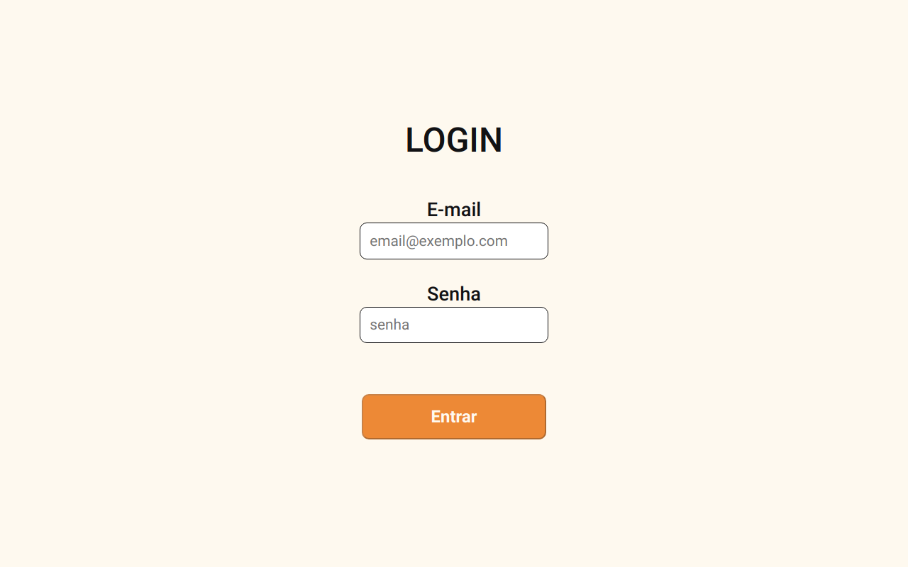

### TrybeLibre

Desafio do curso de FullStack Developer da TRYBE https://www.betrybe.com/
Esse site site foi totalmente reconstruido, sendo transformado de:
 - JavaScript -> TypeScript
 - ReactJS -> NextJs
 - CSS -> SCSS
 - Fetch -> Axios

[Link para o Site](https://recipes-app-lemon.vercel.app/)

## Tech em uso

[React] / [NextJS] Aplication  
Gerenciamento de estado com [Function Components]  
Uso de API externas como...
  - A [The Meal DB](https://www.themealdb.com/api.php)
  - A [The Cocktail DB](https://www.thecocktaildb.com/api.php)

Uso da Biblioteca do compilador SASS para estilização

  *Testes
    - [Linter] para controle da qualidade do codigo.
    - [Jest] com execução de testes por requisito

# Habilidades desenvolvidas.

-Componentizar o site em diversos arquivos menores  

-Criar hooks personalizados  

-Cobrir o 90% do aplicativo com testes (apenas na branch `original`) 

-Fazer uso do type-script para tornar o código mais confiável  

-Fazer uso do ReactRouter para gerenciar a aplicação baseada em SPA (antes da mudança de React -> Next) 

-Fazer uso das propriedades getStaticPaths e getStaticProps do NextJS  

-Tornar o site 100% responsivo, usando o método mobile first  

# Branchs.

#### Cada branch significa uma parte da refatoração do código
-1º `Branch Original` -> código original sem nenhuma alteração (feita pra entregar pra Trybe)  

-2º `adicionando-axios-e-otimizando-a-aplicacao` -> alterando de fetch para axios  

-3º `transicicao-de-javascript-para-typescript` -> alterando de JS -> TS 

-4º `refatorando-para-nextjs` -> alterando de React -> Next  

-`estilizando-o-app-com-SASS` -> branch independente focada para estilização do projeto 

# O que foi desenvolvido.

Um site de receitas, no qual se pode pesquisar tanto coquitéis quanto pratos de comida, nele você primeiramente vai logar seu usuário, e entrando na pagina principal, várias receitas de comida irão aparecer. Nessa tela é possível filtrar os itens por categorias ou pesquisar alguma receita pelo nome, seja o do ingrediente, da própria receita ou com uma letra específica. Na página de coquitéis tem-se as mesmas features, sendo possível acessa-lo pelo menu infeior, clicando em seu ícone. Na página principal é possível clciar num item, para redirecioná-lo para a tela de detalhemento da receita, onde é possível favorita-la e também inicia-la. Na pagina o usuário poderá exporar por ingredientes, por área ou então pegar uma receita aleatório. No perfil, que fica no ícone da barra superior esquerda, é possível acessar sua lista de favoritas e sua lista de receitas feitas.

  - Entrar no site e ver um Searchbar em conjunto de uma lista de categorias e uma lista de receitas.
  - É possível clicar nos cards e ver suas receitas, podendo também iniciá-las.
  - O usuário poderá favoritar e copiar o link de cada receita.
  - O usuário terá uma pagina de explorar, onde será possível categorizar as receitas por ingredientes, area ou então escolher uma receita aleatória.
  - Na página de perfil é possível acessar a página de receitas feitas e favoritas.
